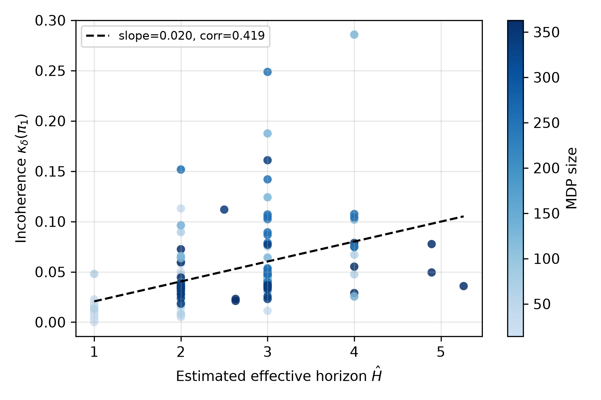
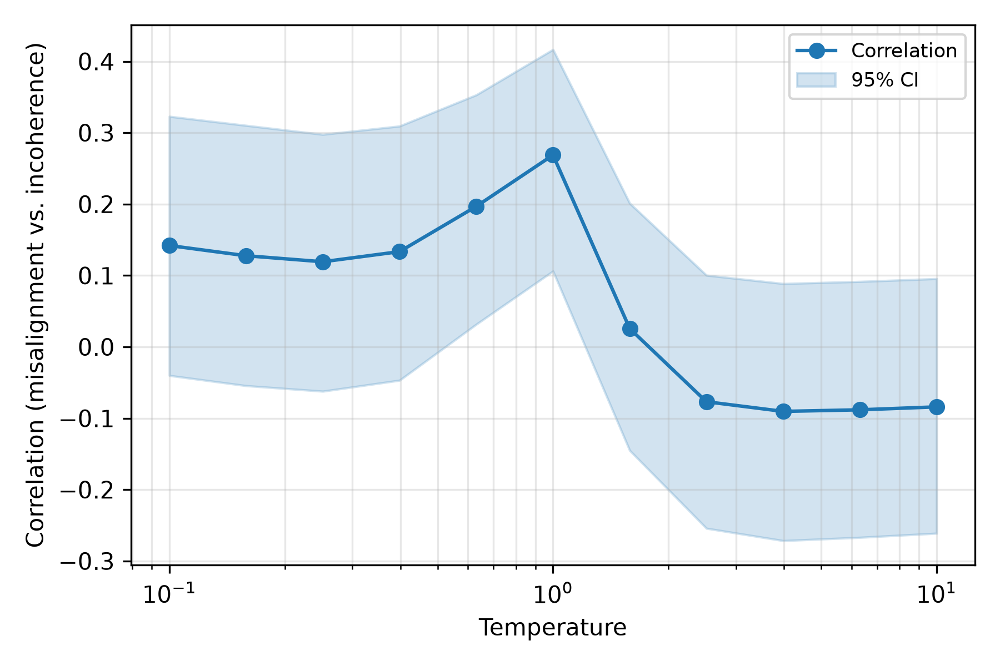
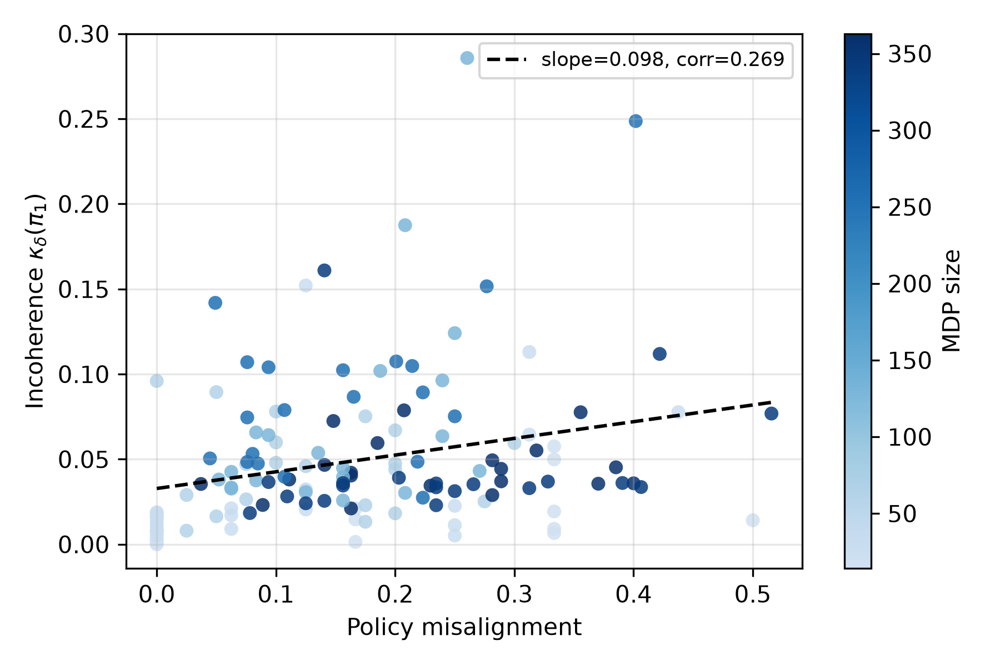
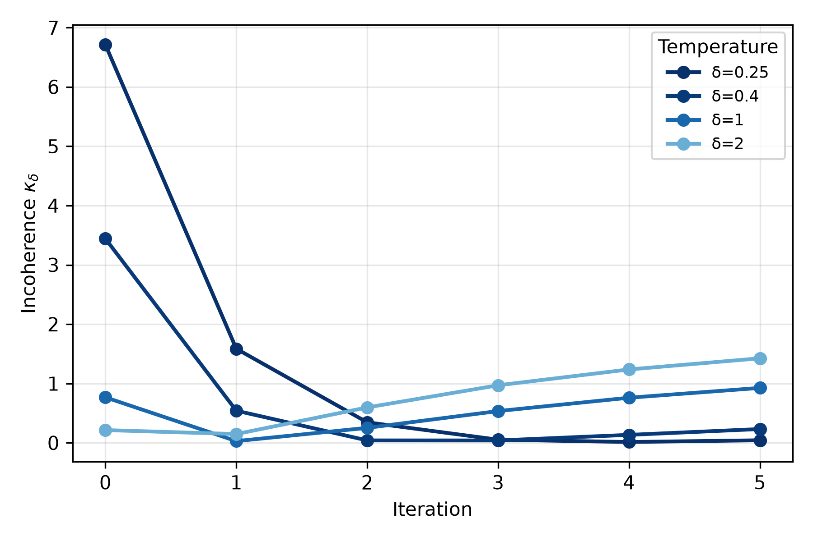
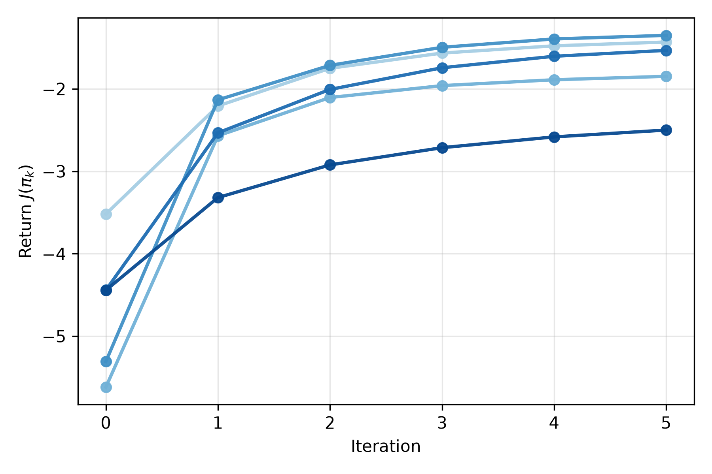
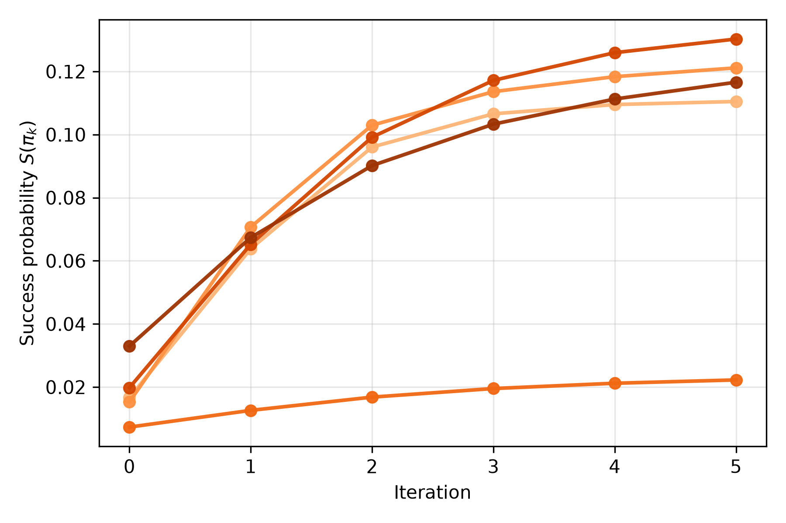

# Incoherence in goal-conditioned autoregressive models

This is an implementation and numerical verification of the main results in the paper "Incoherence in goal-conditioned autoregressive models", Jacek Karwowski and Raymond Douglas, 2025.

## Experiments

All experiments are driven by YAML configuration files stored in `configs/`.

- **Effective horizon vs. incoherence**

  ```bash
  uv run python experiments/effective_horizon.py --config configs/effective_horizon.yaml
  ```

- **Policy misalignment vs. incoherence**

  ```bash
  uv run python experiments/misalignment.py --config configs/misalignment.yaml
  ```

- **Iterated incoherence (deterministic vs. stochastic)**

  ```bash
  uv run python experiments/iterated_incoherence.py --config configs/iterated_incoherence.yaml
  ```

- **Strong return improvement lemma**

  ```bash
  uv run python experiments/strong_return_improvement.py --config configs/strong_return_improvement.yaml
  ```

## Figures

- 
  Correlation r≈0.244 with 95% CI [0.082, 0.394].
- 
  Correlation curve across temperatures with bootstrap confidence intervals.
- 
  Per-environment scatter with r≈0.395 and 95% CI [0.245, 0.526].
- 
  Incoherence decay across temperatures for a representative deterministic and stochastic MDP.
-  and 
  Representative return histories for sampled environments in each family.
