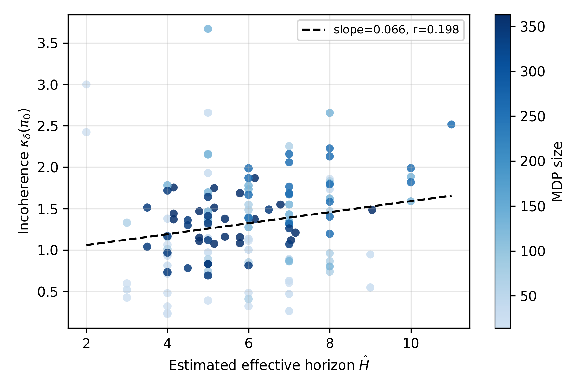
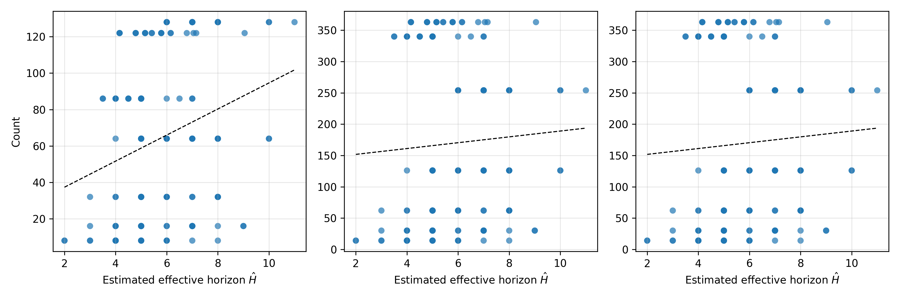
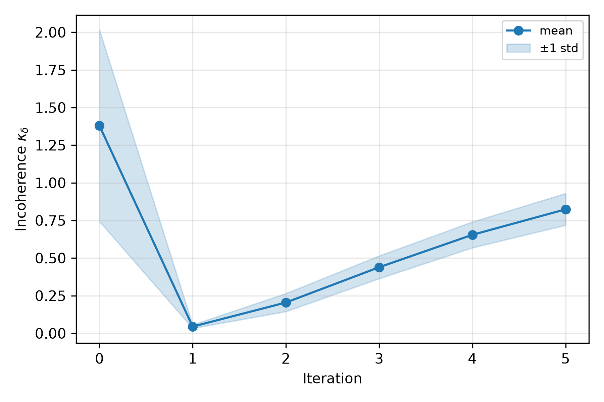
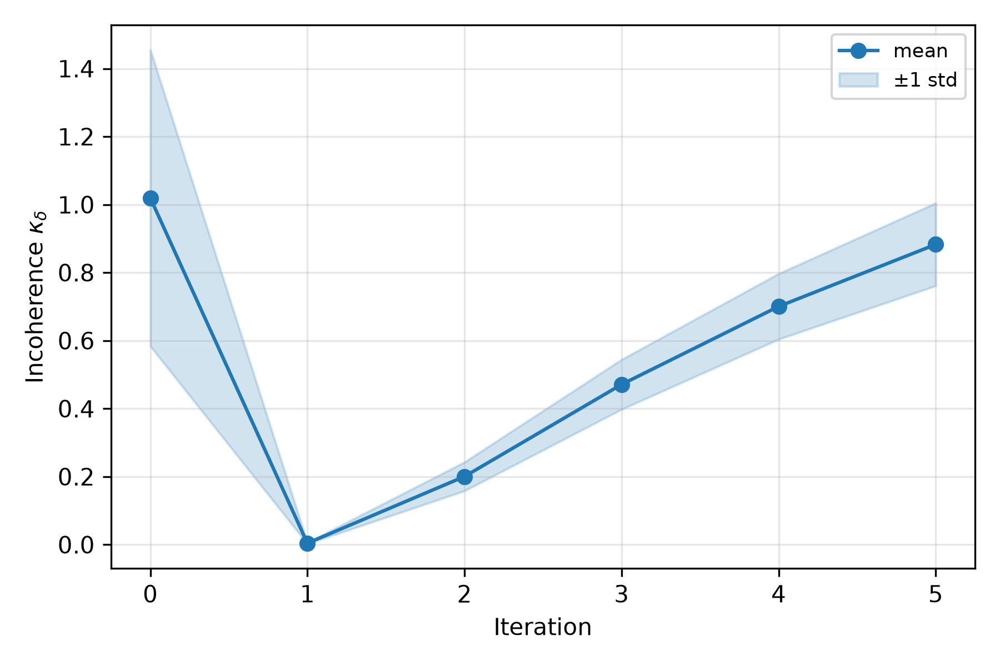
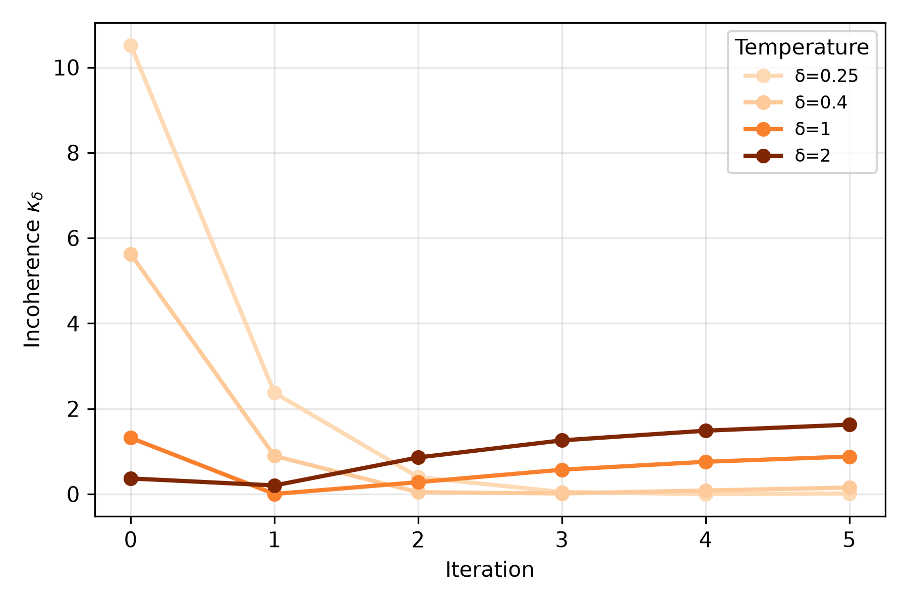
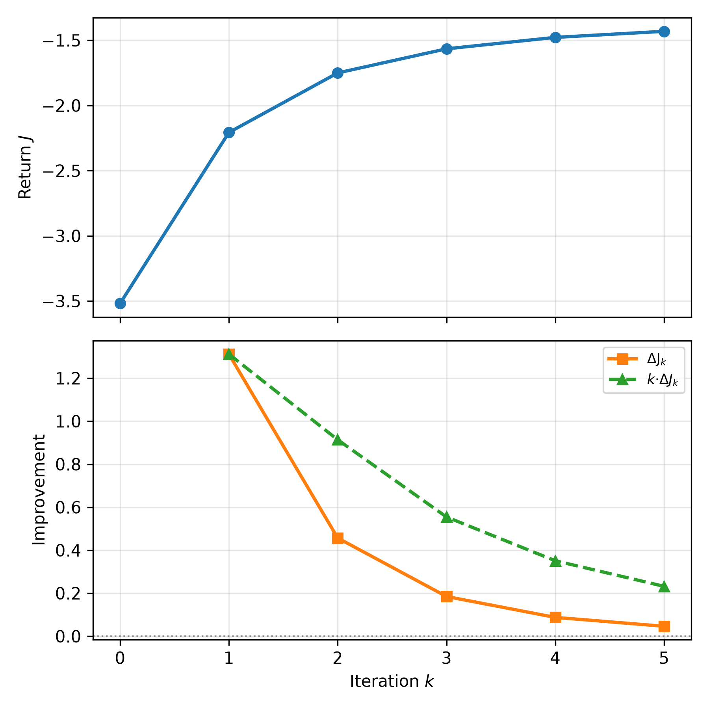

# Incoherence in goal-conditioned autoregressive models

This is an implementation and numerical verification of the main results in the paper "Incoherence in goal-conditioned autoregressive models", Jacek Karwowski and Raymond Douglas, 2025.

## Experiments

All experiments are driven by YAML configuration files stored in `configs/`. The default workflow uses `uv run` so that the project is available in editable mode.

- **Effective horizon vs. incoherence**

  ```bash
  uv run python experiments/effective_horizon.py --config configs/effective_horizon.yaml
  ```

  This populates `results/effective_horizon.json` (and related CSV summaries/plots) using the environment suite described in the config.

- **Policy misalignment vs. incoherence**

  ```bash
  uv run python experiments/misalignment.py --config configs/misalignment.yaml
  ```

  Requires the effective-horizon dataset above; it reuses the same environment specifications when correlating misalignment with incoherence.

- **Iterated incoherence (deterministic vs. stochastic)**

  ```bash
  uv run python experiments/iterated_incoherence.py --config configs/iterated_incoherence.yaml
  ```

  Generates trajectories of κδ as the control-as-inference update 𝒢 is applied repeatedly, illustrating the monotonic decrease predicted in deterministic settings and the non-monotonic behaviour in stochastic ones.

- **Strong return improvement lemma**

  ```bash
  uv run python experiments/strong_return_improvement.py --config configs/strong_return_improvement.yaml
  ```

  Samples fresh deterministic and stochastic environments (per the config) and plots representative return trajectories illustrating the strong return improvement lemma.

- **Full artifact regeneration** (runs both studies and produces tables/figures used in the paper):

  ```bash
  uv run python experiments/generate_paper_artifacts.py
  ```

  The helper script reads the same configuration files and writes aggregate outputs under `results/`.

## Figures

- 
  Correlation r≈0.198 with 95% CI [0.033, 0.352].
- 
  Correlation r≈0.244 with 95% CI [0.082, 0.394].
- 
  Relationship between effective horizon and MDP size characteristics (states/actions/slots).
- 
  Correlation curve across temperatures with bootstrap confidence intervals.
- 
  Per-environment scatter with r≈0.395 and 95% CI [0.245, 0.526].
-  and 
  κ trajectories over successive applications of the control-as-inference operator.
-  and 
  Incoherence decay across temperatures for a representative deterministic and stochastic MDP.
- 
  Return and ΔJ trends illustrating the strong return improvement lemma.
-  and 
  Representative return histories for sampled environments in each family.
